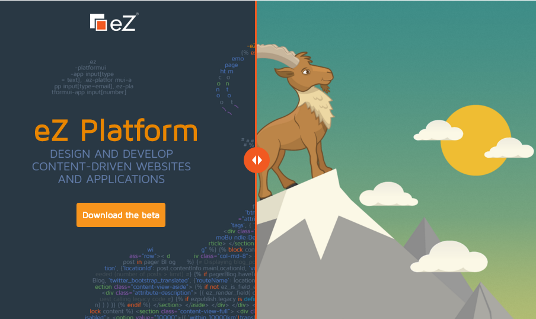

<!-- .slide: data-background="imgs/cache_chip.gif" data-background-transition="concave" data-transition="fade-in fade-out" -->
## "Perfect" caching with FOSHttpCache

<br>

*[Symfony Live SF](http://sanfrancisco2015.live.symfony.com/)*
<br>
*29<small><sup>th</sup></small> October 2015*

<br><br>

<small>
By [André Rømcke](https://github.com/andrerom)/[@andrerom](http://twitter.com/andrerom)
<br><br><br><br>
*With special thanks to creators of FOSHttpCache: [@dbu](https://github.com/dbu), [@ddeboer](https://github.com/ddeboer), [@lolautruche](github.com/lolautruche), others [\[1\]](https://github.com/FriendsOfSymfony/FOSHttpCache/graphs/contributors) [\[2\]](https://github.com/FriendsOfSymfony/FOSHttpCacheBundle/graphs/contributors)*
</small>


Note:
Press "?" for help
Heads up that I might lose my voice or say wrong words during this talk becasue of being drugged down.
But now on to what we are here to talk about, cheese! Sorry, cache.

---

# About

--

## About [myself](http://twitter.com/andrerom)

- Norwegian, lived in Germany and France
- Coding++
 - 1997: (d)Html
 - 2005: PHP & Open Source 
 - 2006: eZ
 - Contributing* to: eZ, Symfony, Composer, FOS, PHP-FIG, ..
 - Somewhat familiar w/ Frontend, Agility, Test Strategy, Hiring..
- Other interests: Music, Bicycling, Skiing, Hiking, ..

<br>

<small>\* or "Trying to" to be more correct</small>


Note:
PHP: Seriously since 2008 after unwilling mentoring by Derick Rethans & others at eZ, as I started to contribute to Core
Contribution: Besides eZ I currently try to contribute to Symfony, FriendsOfSymfony, ~~Node.js~~~
eZ: Been in various roles; Consultant, Project Lead, Engineer, Scrum/Kanban master, VP Engineering
Trivia: Remembers 5 year old conversation/code-change, but not a name 30 seconds later.

--

## About [eZ Platform](https://github.com/ezsystems/ezplatform)

- `eZ Platform`, earlier reffered to as  **`eZ Publish 6.0`**
- Introduced as part of **`eZ Publish Platform 5.0`**
- Builds upon, extends, & contributes to Symfony
- Coming with new UI and on it's own this fall
 - Aims to be a 100% open source project, while **`eZ Studio`** launching at
 the same time building on top of it, and is 100% commercial for media companies


Note:
A feature rich, highly extensible, open source CMS/CMF
5.0 came in 2012, 5.x is hybrid offering both `Platform` and `Publish` in one
Commercial, adds features for editorial organizations

--

## About [eZ Systems AS](http://ez.no)

- **1999** Founded
- **8** Offices across the globe
- **200**+ community & business partners
- **500**+ small to large customers & growing
- **45,000** or so registered community users
- **300,000**+ installations of various versions

Provides additional software, services, consulting, & training for users & partners.


Note:
Notable customers: MadSack, RedBull, Economist, QuickSilver, several universities..


---

<!-- .slide: data-background="imgs/wtf_cat.jpg" data-background-transition="concave" data-transition="fade-in fade-out" -->
# Cache? Proxy? Reverse?

*Shamelessly using 90's illustrations*

--


--


--


Note:
Cable of over 400k request per second in theoretical benchmarks on big iron.
Easily configurable using VCL

---

#  What we want to archive with cache?

--

### TL;DR; We want cache to become transparent & scalable!

- In a mainly read heavy application like a CMS, cache is kind of important <!-- .element: class="fragment" -->
- Cache is complex, but we want to "hide" complexity <!-- .element: class="fragment" -->
 - While still give full access when needed
- Make it possible to scale <!-- .element: class="fragment" -->


---

# Getting there

--

## Symfony2

In Köln in May 2012 with eZ, QaFoo & Benjamin Eberlei:

*"How to have a cache system with same, or better flexibility, while better integrated?"*

--

## Symfony2

- Standardizes on HTTP for cache, fully customizable <!-- .element: class="fragment" -->
- Native ESI fragments theoretically perfect for blocks <!-- .element: class="fragment" -->
- Varnish powering these > Insane performance <!-- .element: class="fragment" -->


--

## HttpCache "issues"

- Logged in users <!-- .element: class="fragment" -->
- Same content/entities on multiple urls <!-- .element: class="fragment" -->
- Slow perf. with many ESI requests on Sf HttpCache <!-- .element: class="fragment" -->

--

## Extending Symfony2

In 2014 FosHttpCache enters based on similar ideas @ Liip, Driebit, eZ, JoliCode and others. Mainly:

- Entity awareness > Tag Cache with entity identifier(s) <!-- .element: class="fragment" -->
 - Example header: ```X-Cache-Tags: location-44, ..``` <!-- .element: class="fragment" -->
- User awareness > Vary Cache by User rights/context <!-- .element: class="fragment" -->
 - Example header: ```Vary: X-User-Context-Hash``` <!-- .element: class="fragment" -->
- Most featurs across Varnish, Sf HttpCache, & Nginx <!-- .element: class="fragment" -->


Note:
In parallel others worked on the same, & similar topics.
End of 2013 joining forces to create FOSHttpCache by contributing several related solutions,
eZ joined in 2014 and contributed User awareness.


--

## Practice time

Let't try to explain these features in practice!

--

<!-- .slide: data-background="imgs/Cache_request1.png" data-background-size="1280px" data-background-transition="concave" data-transition="fade-in fade-out" -->
<br><br><br><br><br><br><br><br><br><br><br><br><br>
### 1/4 "Normal" HTTP Uncached

--

<!-- .slide: data-background="imgs/Cache_request2.png" data-background-size="1280px" data-background-transition="concave" data-transition="fade-in fade-out" -->
<br><br><br><br><br><br><br><br><br><br><br><br><br>
### 2/4 "Normal" HTTP Cached

--

<!-- .slide: data-background="imgs/Cache_request3.png" data-background-size="1280px" data-background-transition="concave" data-transition="fade-in fade-out" -->
<br><br><br><br><br><br><br><br><br><br><br><br><br>
### 3/4 User Context aware


--

<!-- .slide: data-background="imgs/Cache_ban.png" data-background-size="1280px" data-background-transition="concave" data-transition="fade-in fade-out" -->
<br><br><br><br><br><br><br><br><br><br><br><br><br>
### 4/4 "Entity Aware": Ban

Note:
Yes, Varnish allows BAN using custom VCL:
```
    if (req.method == "BAN") {
        if (!client.ip ~ invalidators) {
            return (synth(405, "Not allowed"));
        }

        if (req.http.X-Cache-Tags) {
            ban("obj.http.X-Host ~ " + req.http.X-Host
                + " && obj.http.X-Url ~ " + req.http.X-Url
                + " && obj.http.content-type ~ " + req.http.X-Content-Type
                + " && obj.http.X-Cache-Tags ~ " + req.http.X-Cache-Tags
            );
        } else {
            ban("obj.http.X-Host ~ " + req.http.X-Host
                + " && obj.http.X-Url ~ " + req.http.X-Url
                + " && obj.http.content-type ~ " + req.http.X-Content-Type
            );
        }

        return (synth(200, "Banned"));
```

--


## Or? <!-- .element: class="fragment" -->

--

### Houston, more problems!
#### Current state:

- Multi tagging only with Varnish <!-- .element: class="fragment" -->
- Varnish BAN not graceful, theory: dog-piling under load  <!-- .element: class="fragment" -->

Note:
no multi tagging makes it hard to reliably inline several esi requests to avoid the ESI perf issue.
dog-piling aka Cache stamped when using BAN which is used for purging cache by tags.

---


# Next


--

### Tags

<small>*To be able to avoid to many ESI request when using Symfony HttpCache we need multi tagging to clear cache representing several entities.*</small>

- Abstracting Tags\* from Varnish <!-- .element: class="fragment" -->
- Add support in Symfony HttpCache <!-- .element: class="fragment" -->
- Should also be possible for Nginx <!-- .element: class="fragment" -->

<small class="fragment">\* [Abstracting tags PR](https://github.com/FriendsOfSymfony/FOSHttpCache/pull/237)</small>

--


### Graceful Ban

<small>*To be able to have graceful cache also when purging/expiring by tag, currently using: BAN*</small>

- Varnish is not adding "SoftBan" anytime soon <!-- .element: class="fragment" -->
- Potentially own tag handling & use PURGE per URL? <!-- .element: class="fragment" -->
 - Setup Symfony HttpCache to just cache tags, expiry & urls? <!-- .element: class="fragment" -->
 - Use this for PURGEs, & custom VCL rules to expire URLS? <!-- .element: class="fragment" -->

Note:
SoftBan: If you have connections, make sure to put pressure on Varnish ;)

--

<!-- .slide: data-background="imgs/Cache_tag_purge.png" data-background-size="1280px" data-background-transition="concave" data-transition="fade-in fade-out" -->
<br><br><br><br><br><br><br><br><br><br><br><br><br>
### Tags Purging

Note:
Async since number of url's across number of Varnish servers might be a low, Async in this case refer to allowing ques
to handle the purging, can be Symfony kernel.terminate out of the box allowing other bundles to extend that.
Varnish here can be any Reverse Proxy cache supporting purging/expiry.


--

## And then?

 <!-- .element: class="fragment" -->

### ?? <!-- .element: class="fragment" -->

---

### The end


-------------------

#### eZ

<p align="left">
[eZ Platform](https://github.com/ezsystems/ezplatform)<br>
Twitter:  [@andrerom](https://twitter.com/andrerom)<br>
Mettups: [Oslo](http://www.meetup.com/eZ-Oslo-Meetup), [Paris](http://www.meetup.com/ezpublish-paris-meetup),
 [Lyon](http://www.meetup.com/Lyon-eZ-Publish-Meetup), [New York](http://www.meetup.com/newyorkezusercommunity),
 [Köln](http://www.meetup.com/Koln-eZ-Publish-Meetup/), [San Francisco](http://www.meetup.com/San-Francisco-eZ-Publish-Meetup/)<br>
See more slides on [http://ezsystems.github.io/slides/](http://ezsystems.github.io/slides/)
</p>

-------------------

#### FOSHttpCache

<p align="left">
[FOSHttpCache](https://github.com/FriendsOfSymfony/FOSHttpCache)<br>
[FOSHttpCacheBundle](https://github.com/FriendsOfSymfony/FOSHttpCacheBundle)
</p>


---

### Q&A

<div style="border: 1px solid #bbb">
  <div style="position: relative; left: -400px; top:-16px; font-size: 40%; color: #aaa">Shameless Advertising</div>
  <br>
</div>


NOTE:
@todo Add note on that we are hiring!